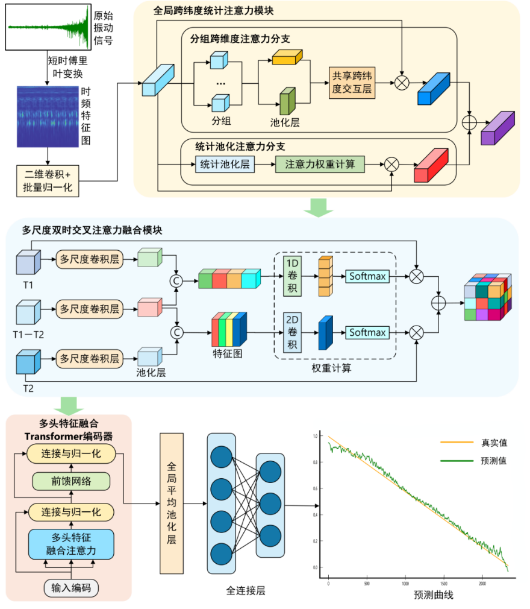

# CBFAN: Cross-Dimensional Dual-Temporal Attention Fusion Network for Bearing RUL Prediction

> Bearing remaining useful-life prediction method based on cross-dimensional dual-temporal attention fusion (CBFAN)

本仓库包含论文 **CBFAN（Cross-Dimensional Dual-Temporal Attention Fusion Network）** 的实验代码与数据，用于滚动轴承剩余寿命（Remaining Useful Life, RUL）预测及相关对比 / 消融实验。

## 项目概览

CBFAN 主要面向滚动轴承剩余寿命预测任务，通过结合时域、频域以及多尺度统计特征，构建跨维度、双时间尺度的注意力融合网络，以提升 RUL 预测的精度与稳定性。

下图展示了 CBFAN 方法的整体框架，从原始振动信号出发，依次经过全局跨维度统计注意力模块、多尺度双时序注意力融合模块以及多头特征融合 Transformer 编码器，最终输出轴承的剩余寿命预测曲线。



本仓库中包含：

- CBFAN 主模型的训练与测试代码及示例模型权重；
- 与 Transformer‑BiLSTM、CNN‑Transformer 等方法的对比实验代码与结果；
- 不同轴承工况（如 Bearing1_1 ~ Bearing1_7）的数据集划分和预处理脚本；
- 消融实验代码以及各类可视化与绘图脚本（对比实验、消融实验、RUL 曲线等）。

> 注意：本 README 仅依据仓库中的文件 / 文件夹命名以及论文摘要信息撰写，并未深入解析具体实现细节，便于你在不阅读源码的情况下了解整体结构和使用方式。

## 环境依赖

推荐使用 Python 3.8+。核心依赖请参考根目录下的 `requirements.txt`：

- 深度学习框架（例如 PyTorch 等）
- 数据处理：NumPy、Pandas 等
- 可视化：Matplotlib 等

可以使用如下方式（示例）创建虚拟环境并安装依赖：

```bash
# 创建并激活虚拟环境（示例命令，按需调整）
python -m venv venv
venv\Scripts\activate

# 安装依赖
pip install -r requirements.txt
```

## 目录说明（按模块划分）

以下根据当前仓库的文件 / 文件夹命名，对各功能模块做说明，便于快速定位代码和数据。**注意：下面使用的目录名称为已经英文化后的命名（见后文“重命名说明”）**。

### 根目录

- `requirements.txt`：项目所需 Python 依赖列表。
- `setup.py`：安装 / 打包相关配置（如将项目以包形式安装）。
- `utils.py`：通用工具函数，例如数据加载、指标计算、日志打印等。
- `__init__.py`：将根目录视为 Python 包。
- `paper_content.png`：论文摘要截图或说明性图片。

### 1. RemainingLifePredictionModel

对应原始目录 `剩余寿命预测模型/`，主要包含 CBFAN 主模型及其相关的实验部分。

- `CBFAN-model/`
  - `CBFAN.ipynb`：CBFAN 主模型的 Jupyter Notebook，实现模型搭建、训练与测试流程。
  - `best_model_transformer_bilstm.pt`：示例/最优模型权重（Transformer‑BiLSTM 结构，可能作为子模块或对比基线）。
- `DataVisualization.ipynb`（原 `数据集制作与可视化.ipynb`）：数据集制作与可视化示例，包括特征提取、样本划分和关键统计图表。
- `plot_compare/`（原 `画图对比/`）
  - `cnn_transformer_origin/`：CNN‑Transformer 原始模型的预测结果与可视化。
  - `cnn_transformer_pre/`：CNN‑Transformer 预处理/改进版本的预测结果与可视化。

### 2. ComparisonExperiments

对应原始目录 `对比实验/`，用于存放与其他模型的对比实验代码及结果。

- `Transformer-BiLSTM-serial-model/`（原 `Transformer-BiLSTM（串行）预测模型/`）
  - `model/`（原 `模型/`）
    - `Transformer-BiLSTM.ipynb`：Transformer‑BiLSTM 串行结构的预测模型 Notebook。
    - `best_model_transformer_bilstm.pt`：对应的最优模型权重。
  - `bearing_1-7/`
    - `Transformer-BiLSTM.ipynb`：在具体轴承工况（如 Bearing1_7）上的实验 Notebook。
    - `best_model_transformer_bilstm.pt`：该工况下训练得到的权重。
  - `dataresult/`
    - `train_set/`, `train_label/`, `test_set/`, `test_label/`：按数据集划分存放训练/测试样本与标签，用于对比模型训练和验证。
  - `plot_compare/`（原 `画图对比/`，如果有内容会用于该模型的结果可视化）。

### 3. DatasetPreprocess

对应原始目录 `数据集预处理/`，用于原始轴承数据的清洗与特征提取。

- `data_preprocess.py`（原 `数据预处理.py`）：数据预处理主脚本，例如：
  - 从原始振动信号或监测数据中截取样本；
  - 进行时域 / 频域特征提取；
  - 依据剩余寿命标签进行滑动窗口切分等。
- `Bearing1_2_features_df/`：与 Bearing1_2 工况相关的特征数据（例如 DataFrame 序列文件）。
- `FUll_Bearing1_3_all_data/`：Bearing1_3 全量原始数据。
- `FUll_Bearing1_3_features_df/`：Bearing1_3 特征数据集。

这些文件通常是 CBFAN 及对比模型训练时的数据来源。

### 4. AblationExperiments

对应原始目录 `消融实验/`，用于评估不同模块（如跨维度注意力、双时序注意力、多头特征融合 Transformer 编码器等）对整体性能的贡献。

- `cnn-transform-bfm/`
  - `CNN-Transformer-model.ipynb`（原 `CNN-Transformer预测模型.ipynb`）：CNN‑Transformer 相关模型结构、训练与实验流程。
  - `best_model_cnn_transformer.pt`：在基线或改进结构下训练得到的最优模型权重。
  - `dataresult/`
    - `samples_data_Bearing1_1.csv`, `samples_data_Bearing1_2.csv`, `samples_data_FUll_Bearing1_3.csv`：各轴承工况下的样本数据。
    - `scaler/`：标准化或归一化的缩放器参数（例如 `sklearn` 的 `StandardScaler` 持久化文件）。
    - `train_set/`, `train_label/`, `test_set/`, `test_label/`：消融实验对应的数据集划分。
  - `bearing_1-4/` ~ `bearing_1-7/`
    - 各个工况下对应的 Notebook（`CNN-Transformer-model.ipynb`）和最优权重 `best_model_cnn_transformer.pt`。
  - `original/`（原 `原版/`）
    - `30epoch/`, `50epoch/`：在不同训练轮数下的原始模型实验结果。
      - `CNN-Transformer-model.ipynb`
      - `best_model_cnn_transformer.pt`
  - `plot_compare/`：空目录或预留的图像输出位置（当前为空）。
- `plot_compare/`（原 `画图对比/`）
  - `cnn_transformer_origin/`, `cnn_transformer_pre/`：消融实验中 CNN‑Transformer 相关可视化输出，如不同设置下的 RUL 曲线或误差对比图。

### 5. PlotCompare

对应原始目录 `画图对比/`，集中存放对比实验与消融实验的绘图脚本及结果图片。

- `ComparisonExperiments/`（原 `对比实验/`）
  - `cnn_origin/`, `cnn_pre/`, `cnn_lstm_origin/`, `cnn_lstm_pre/`, `cnn_transformer_origin/`, `cnn_transformer_pre/`, `gru_origin/`, `gru_pre/`, `transformer_origin/`, `transformer_pre/`, `transformer_bilstm_serial_pre/`：
    - 各种网络结构（CNN、GRU、Transformer、Transformer‑BiLSTM 串行等）在不同设置（如原始 vs. 预处理）的可视化结果目录，一般包含 RUL 预测曲线、误差分布等图像。
  - `ComparisonPlot.py`（原 `对比实验对比图.py`）：生成对比实验图像的 Python 脚本。
  - `ComparisonPlot.ipynb`（原 `对比实验对比画图.ipynb`）：对比实验可视化 Notebook。
  - `ComparisonPlot_backup.ipynb`（原 `对比实验对比画图备份.ipynb`）：备份版本。
  - `ComparisonPlot.png`（原 `对比实验对比图.png`）：对比实验结果示意图。
- `AblationExperiments/`（原 `消融实验/`）
  - `A_cnn_transformer_origin/`, `A_cnn_transformer_pre/`：消融实验下不同 CNN‑Transformer 变体的可视化结果。
  - `AblationPlot.ipynb`（原 `消融实验对比画图.ipynb`）：消融实验对比图的 Notebook。
  - `AblationPlot.py`（原 `消融实验对比画图.py`）：消融实验绘图脚本。

## 使用建议

以下给出一种典型的使用流程，便于快速复现 CBFAN 相关实验（具体以 Notebook 与脚本中的参数为准）：

1. **环境准备**  
   安装 Python 及依赖库，确保可以运行 Jupyter Notebook。

2. **数据预处理**  
   在 `DatasetPreprocess/` 中运行 `data_preprocess.py`，或参考 `DataVisualization.ipynb` 中的数据制作流程，生成所需的特征数据文件和样本划分。

3. **训练 CBFAN 模型**  
   在 `RemainingLifePredictionModel/CBFAN-model/` 中打开 `CBFAN.ipynb`，根据其中的说明完成：
   - 数据加载与划分（使用 `dataresult/` 或 `DatasetPreprocess/` 输出的数据）；
   - 模型结构配置（跨维度注意力、双时序注意力、多头特征融合 Transformer 编码器等）；
   - 模型训练与验证，并保存最优权重到对应的 `.pt` 文件。

4. **对比实验**  
   在 `ComparisonExperiments/`、`PlotCompare/ComparisonExperiments/` 等目录中，分别运行 Transformer‑BiLSTM、CNN‑Transformer 等基线模型的 Notebook 和绘图脚本，生成与 CBFAN 的性能对比曲线（如 MAE、RMSE、Score 等指标）。

5. **消融实验**  
   在 `AblationExperiments/` 相关目录下，逐项移除或替换 CBFA N 的关键模块（如跨维度注意力、双时序注意力、特征融合编码器等），运行 `CNN-Transformer-model.ipynb` 和对应的绘图脚本，分析各模块对整体性能的贡献。

6. **可视化与结果分析**  
   通过 `PlotCompare/` 目录下的脚本和 Notebook 生成不同模型、不同实验设置下的对比和消融图像，结合论文中的指标，完成对 CBFAN 方法的综合评估。

## 引用

如果你在研究工作中使用了本仓库中的代码或实验结果，请引用原论文：
Bearing remaining useful-life prediction method based on cross-dimensional dual-temporal attention fusion.
